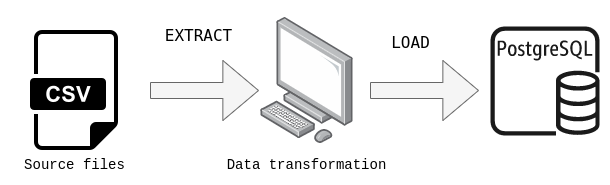

## **Practicando PySpark con datos del subte de BA**

El notebook presente en este repositorio está destinado a procesar datos vinculados a los subtes de la Ciudad de Buenos Aires, específicamente sobre la cantidad de pasajeros por molinete de todas las estaciones de la red de Subte.
Los datasets se encuentran disponible [aquí](https://data.buenosaires.gob.ar/dataset/subte-viajes-molinetes)

En el sitio [Buenos Aires Data]() se encuentra una gran variedad de datos abiertos.

### **Entorno de trabajo**
Se trabaja de manera local con una imagen de docker que incluye todo lo necesario para trabajar con PySpark

Dicha docker image está disponible [aquí](https://hub.docker.com/r/jupyter/pyspark-notebook/)

El proceso consistió en extraer varios archivos csv, remover y modificar columnas y, finalmente, cargar los datos modificados a una base de datos PostgreSQL

